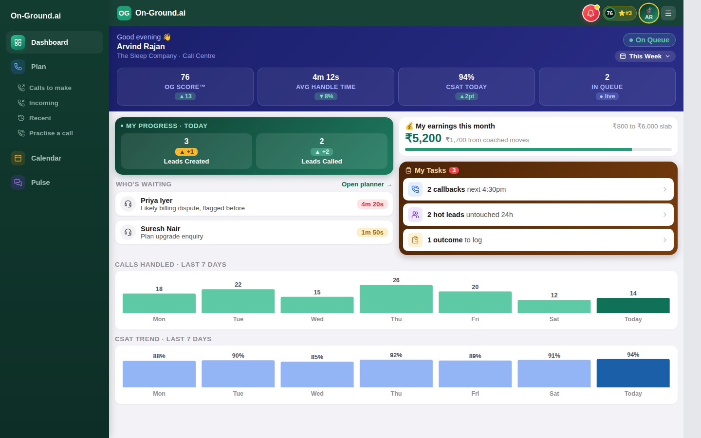

# On-Ground.ai — Call Centre App (React + JavaScript)

My implementation of the On-Ground.ai engineering intern assignment: the app a call-centre agent keeps open through a shift. It is frontend-only, runs on local sample data, and was written from scratch against the assignment PDF and the reference mock (used for look and behaviour only; none of its source or markup is copied).



## Run it

Prerequisites: Node.js 20+ and npm. (Written in plain JavaScript, so there is no type-checking step.)

```bash
npm install
npm run dev        # http://localhost:5173
```

Other commands:

```bash
npm run build      # production build into dist/
npm run preview    # serve the production build
npm test           # unit tests (Vitest)
npm run lint       # oxlint
```

## Stack and why

| Choice | Reason |
| --- | --- |
| React 19 + Vite, plain JavaScript (ES modules, JSX) | React is the preferred stack in the brief. Plain JavaScript with modern ES modules and JSX. |
| React Router | Real URLs for every screen (`/plan/incoming`, `/pulse/callcentre-team`), so back/forward and the sidebar active state fall out of the router. |
| Plain CSS files + design tokens (`src/styles/tokens.css`) | The mock has a small, consistent visual system; tokens for colour, type size, spacing and radii keep it coherent without a styling dependency. |
| Lucide React | Consistent icon set. |
| Recharts | Seven-day bar charts with labels and tooltips. |
| Vitest | Tests for pagination and calendar logic. |

No backend, API keys or external services. No global state library: three small React contexts only.

## What is implemented

**Must-build**
- **App shell:** persistent sidebar (Dashboard, Plan with sub-items, Calendar, Pulse) with correct active states, top bar with notifications popover, OG score / rank pill and profile menu.
- **Dashboard:** greeting and KPI cards, today's progress, who's waiting, monthly earnings with slab bar, My Tasks (opens the Leads modal), 7-day calls and CSAT charts.
- **Plan → Calls to make:** leads ranked by score, expandable rows (phone, last touch, next step, suggested opener, call / WhatsApp / full picture), working pagination (2 per page, 3 pages).
- **Plan → Incoming:** missed calls with expected value, total at stake (computed), a Call back button on every row.
- **Plan → Recent:** calls with type, time and duration; selecting one opens a review dialog (SOP score, summary, notes, call back).
- **Calendar:** Sunday-first month grid with correct alignment, event dots, previous/next month (December ↔ January handled), Today button, selected-date state, events for the selected day plus an Upcoming list.
- **Pulse home:** AvaniBot card, collapsible Custom Agents (role and task agents with metrics), General, Kudos (opens a feed and clears its NEW badge), Channels, Direct messages, a working search filter. Every row opens its channel, previews show each conversation's latest message, and unread badges clear once a channel is opened.
- **Pulse channel:** every agent, channel and DM has a seeded conversation. Back button, header, pinned "Needs your input" card (in #callcentre-team), reply box, left/right chat bubbles with times. AvaniBot and the agent channels give a canned local reply to anything you send; human channels do not.
- **Leads modal:** reusable; ICP score bar, lead intent score, collapsible ICP breakdown / How we got here / buying signals, tips, Previous/Next that change the real lead, first/last handled, close button, backdrop click and Escape.

**Bonus**
- Sending messages in a channel (appears immediately, input clears, empty messages rejected with an accessible error).
- "Needs your input": **Confirmed** posts a reply and resolves the card; **Reschedule** offers times and resolves with the chosen one; typing a free-text answer also works.
- Call back (Incoming, Recent, Leads modal, Calls to make) and **Practise a call** (ringing → accept/decline → timer, mute, end) through a floating call panel.
- Phone-width layout: sidebar becomes a slide-in drawer, grids collapse, modals become bottom sheets.
- Recharts charts.

## Intentionally skipped / limitations
- The mock's DEMO strip and floating dial pad are optional demo tools and are not built.
- Avatar, Settings and Logout in the profile menu show a "not part of this demo" toast; so do the new-conversation (+) and emoji buttons.
- Data is static and in memory, so changes (messages, answered card) reset on page refresh.
- Some mock details are approximated from the PDF screenshots and my own screenshots rather than pixel-measured, notably spacing in the channel view and the exact lead sample data. I did not do an automated pixel-diff.
- Chrome on a laptop was the only browser tested; no Safari/Firefox checks.
- There is no static type checking. Data shapes are documented by the sample data in `src/data`.
- `oxlint` reports 3 dev-only Fast Refresh notes because the context hooks live next to their providers.
- No deployment: there is no live link yet.

## Architecture

```
src/
  components/layout/   AppShell, Sidebar, TopBar (shared across routes)
  components/ui/       Modal (a11y dialog), Avatar, CallPanel
  context/             ToastContext, CallContext, PulseContext
  data/                sample data (leads, plan, calendar, pulse, dashboard)
  features/
    dashboard/         DashboardPage, BarTrendChart
    plan/              PlanLayout, CallsToMake, Incoming, Recent, CallDetailModal, Pagination
    calendar/          CalendarPage
    pulse/             PulseHome, PulseChannel, NeedsInputCard, KudosModal
    leads/             LeadsModal, CollapsibleSection
  styles/              tokens.css, global.css (feature CSS sits beside its components)
  utils/               pagination, calendar maths, formatting (+ unit tests)
```

**Sample data** lives only in `src/data` and is imported by feature components; components never hard-code records.
**State:** local `useState` for UI state (page, expanded row, selected date, modal index). Three small contexts hold genuinely cross-screen state: toasts, the active call, and Pulse messages / pinned-card status (so a conversation survives navigating away and back). Pure logic (paging, month shifting, grid building) is in `src/utils` so it is unit-tested.
**Accessibility:** semantic landmarks, labelled buttons, `aria-expanded` on disclosures, dialogs with `aria-modal`, focus moved in and restored, Escape to close, visible focus rings, live regions for toasts, page labels and form errors.

## Testing performed

- `npm test`: 9 Vitest tests pass (pagination bounds, month rollover Dec→Jan and Jan→Dec, multi-month jumps, October 2026 weekday alignment, leap-year February, formatting).
- `npm run build` succeeds; `npm run lint` reports 0 errors and 3 warnings (dev-only Fast Refresh notes, see above).
- Two Playwright scripts, run against the dev server in Chromium, `e2e/smoke.py` and `e2e/pulse.py`. In my final run, all 52 smoke checks and all 26 Pulse checks passed and no console errors or warnings were recorded.
  - **Smoke:** sidebar routes, dashboard charts, Leads modal (open, next/previous, first/last disabled, collapsibles, Escape, backdrop), Calls to make (expand, pages 1–3), Incoming total and Call back, Recent review dialog, Practise a call, calendar (alignment, dots, selection, Dec→Jan, Today), Pulse search, channel navigation, message send and empty validation, both pinned-card paths, and no horizontal overflow at 390px on seven routes.
  - **Pulse:** all 16 conversations have real seeded content, the divider names the right channel, unread badges clear when a channel is opened (others untouched), home previews follow the latest message, the Kudos NEW badge clears, bot replies appear only in bot/agent channels.
  - To run them: `pip install playwright && playwright install chromium`, start the app with `npm run dev`, then `APP_URL=http://localhost:5173 python3 e2e/smoke.py` (or `pulse.py`). They are developer aids, not part of `npm test`.
- I compared my screenshots with screenshots of the original mock side by side by eye.

## AI tools used

This project was produced with **Claude (Anthropic)** acting as a coding agent in a chat environment with a sandboxed shell and headless Chromium. It inspected the supplied PDF and mock, scaffolded the project, wrote the code and tests, and ran the browser checks above. I have reviewed it and can explain it.

> Author: if you also used other tools (for example Antigravity), add them here. Only list tools you actually used.
